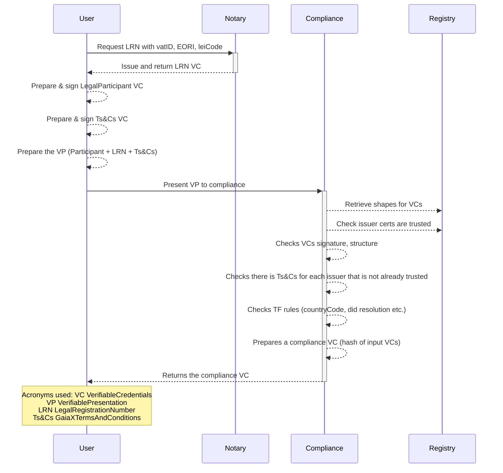

[[_TOC_]]
## Get Started Using the API

- You can find the Swagger API documentation at `localhost:3000/docs/` or one of the links above

### Simplified usage flow



### How to create credentials

#### Step 1 - Create your VerifiableCredential

You can use the VerifiablePresentation in the [test folder](https://gitlab.com/gaia-x/lab/compliance/gx-compliance/-/tree/main/src/tests/fixtures) as a starting point. See details in the [Architecture Document](https://gaia-x.gitlab.io/policy-rules-committee/trust-framework/participant/) and just remove the `proof`.


**Example Participant VerifiableCredential**

```json
    {
  "@context": [
    "https://www.w3.org/2018/credentials/v1",
    "https://w3id.org/security/suites/jws-2020/v1",
    "https://registry.lab.gaia-x.eu/development/api/trusted-shape-registry/v1/shapes/jsonld/trustframework#"
  ],
  "type": [
    "VerifiableCredential"
  ],
  "id": "https://wizard.lab.gaia-x.eu/api/credentials/2d37wbGvQzbAQ84yRouh2m2vBKkN8s5AfH9Q75HZRCUQmJW7yAVSNKzjJj6gcjE2mDNDUHCichXWdMH3S2c8AaDLm3kXmf5R8DFPWTYo5iRYkn8kvgU3AjMXc2qTbhuMHCpucKGgT1ZMkcHUygZkt11iD3T8VJNKYwsdk4MGoZwdqoFUuTKVcsXVTBA4ofD1Dtqzjavyng5WUpvJf4gRyfGkMvYYuHCgay8TK8Dayt6Rhcs3r2d1gRCg2UV419S9CpWZGwKQNEXdYbaB2eTiNbQ83KMd4mj1oSJgF7LLDZLJtKJbhwLzR3x35QUqEGevRxnRDKoPdHrEZN7r9TVAmvr9rt7Xq8eB4zGMTza59hisEAUaHsmWQNaVDorqFyZgN5bXswMK1irVQ5SVR9osCCRrKUKkntxfakjmSqapPfveMP39vkgTXfEhsfLUZXGwFcpgLpWxWRn1QLnJY11BVymS7DyaSvbSKotNFQxyV6vghfM2Jetw1mLxU5qsQqDYnDYJjPZQSmkwxjX3yenPVCz6N2ox83tj9AuuQrzg5p2iukNdunDd2QCsHaMEtTq9JVLzXtWs2eZbPkxCBEQwoKTGGVhKu5yxZjCtQGc?vcid=unsightly-potato",
  "issuer": "did:web:wizard.lab.gaia-x.eu:api:credentials:2d37wbGvQzbAQ84yRouh2m2vBKkN8s5AfH9Q75HZRCUQmJW7yAVSNKzjJj6gcjE2mDNDUHCichXWdMH3S2c8AaDLm3kXmf5R8DFPWTYo5iRYkn8kvgU3AjMXc2qTbhuMHCpucKGgT1ZMkcHUygZkt11iD3T8VJNKYwsdk4MGoZwdqoFUuTKVcsXVTBA4ofD1Dtqzjavyng5WUpvJf4gRyfGkMvYYuHCgay8TK8Dayt6Rhcs3r2d1gRCg2UV419S9CpWZGwKQNEXdYbaB2eTiNbQ83KMd4mj1oSJgF7LLDZLJtKJbhwLzR3x35QUqEGevRxnRDKoPdHrEZN7r9TVAmvr9rt7Xq8eB4zGMTza59hisEAUaHsmWQNaVDorqFyZgN5bXswMK1irVQ5SVR9osCCRrKUKkntxfakjmSqapPfveMP39vkgTXfEhsfLUZXGwFcpgLpWxWRn1QLnJY11BVymS7DyaSvbSKotNFQxyV6vghfM2Jetw1mLxU5qsQqDYnDYJjPZQSmkwxjX3yenPVCz6N2ox83tj9AuuQrzg5p2iukNdunDd2QCsHaMEtTq9JVLzXtWs2eZbPkxCBEQwoKTGGVhKu5yxZjCtQGc",
  "issuanceDate": "2023-07-05T14:30:39.587Z",
  "credentialSubject": {
    "type": "gx:LegalParticipant",
    "gx:legalName": "Gaia-X European Association for Data and Cloud AISBL",
    "gx:legalRegistrationNumber": {
      "id": "https://gaia-x.eu/legalRegistrationNumber.json"
    },
    "gx:headquarterAddress": {
      "gx:countrySubdivisionCode": "BE-BRU"
    },
    "gx:legalAddress": {
      "gx:countrySubdivisionCode": "BE-BRU"
    },
    "gx-terms-and-conditions:gaiaxTermsAndConditions": "70c1d713215f95191a11d38fe2341faed27d19e083917bc8732ca4fea4976700",
    "id": "https://wizard.lab.gaia-x.eu/api/credentials/2d37wbGvQzbAQ84yRouh2m2vBKkN8s5AfH9Q75HZRCUQmJW7yAVSNKzjJj6gcjE2mDNDUHCichXWdMH3S2c8AaDLm3kXmf5R8DFPWTYo5iRYkn8kvgU3AjMXc2qTbhuMHCpucKGgT1ZMkcHUygZkt11iD3T8VJNKYwsdk4MGoZwdqoFUuTKVcsXVTBA4ofD1Dtqzjavyng5WUpvJf4gRyfGkMvYYuHCgay8TK8Dayt6Rhcs3r2d1gRCg2UV419S9CpWZGwKQNEXdYbaB2eTiNbQ83KMd4mj1oSJgF7LLDZLJtKJbhwLzR3x35QUqEGevRxnRDKoPdHrEZN7r9TVAmvr9rt7Xq8eB4zGMTza59hisEAUaHsmWQNaVDorqFyZgN5bXswMK1irVQ5SVR9osCCRrKUKkntxfakjmSqapPfveMP39vkgTXfEhsfLUZXGwFcpgLpWxWRn1QLnJY11BVymS7DyaSvbSKotNFQxyV6vghfM2Jetw1mLxU5qsQqDYnDYJjPZQSmkwxjX3yenPVCz6N2ox83tj9AuuQrzg5p2iukNdunDd2QCsHaMEtTq9JVLzXtWs2eZbPkxCBEQwoKTGGVhKu5yxZjCtQGc#c13fea400bb3b6082a0bc5dfbb9924d0d1c0e5459d53b8139b708cc4eab4fb1b"
  }
}
```

#### Step 2 - Sign your Participant VerifiableCredential
##### Manually

> **Note:**
> If you need help setting up your certificate, you can refer to the "[How to setup certificates](#how-to-setup-certificates)" section.

For this step you can use the wizard to perform all steps automatically: https://wizard.lab.gaia-x.eu/

Credentials need to be signed by a resolvable key registered in a Trust Anchor endorsed by Gaia-X. The validity of keys is checked via the [Gaia-X Registry](https://gitlab.com/gaia-x/lab/compliance/gx-registry/).

To normalize your credential you can use any library that will provide `URDNA2015` normalization eg:`jsonld` .

The normalized Self Description should then be hashed with `sha256(normalizeSd)`. This hash can now be signed with your key resulting in a `jws`. Create a `proof` property with your signature and signing method.

**Example proof object (signature of the Self Description creator)**

```json
{
  "proof": {
    "type": "JsonWebSignature2020",
    "created": "2023-07-05T14:30:39.852Z",
    "proofPurpose": "assertionMethod",
    "verificationMethod": "did:web:wizard.lab.gaia-x.eu:api:credentials:2d37wbGvQzbAQ84yRouh2m2vBKkN8s5AfH9Q75HZRCUQmJW7yAVSNKzjJj6gcjE2mDNDUHCichXWdMH3S2c8AaDLm3kXmf5R8DFPWTYo5iRYkn8kvgU3AjMXc2qTbhuMHCpucKGgT1ZMkcHUygZkt11iD3T8VJNKYwsdk4MGoZwdqoFUuTKVcsXVTBA4ofD1Dtqzjavyng5WUpvJf4gRyfGkMvYYuHCgay8TK8Dayt6Rhcs3r2d1gRCg2UV419S9CpWZGwKQNEXdYbaB2eTiNbQ83KMd4mj1oSJgF7LLDZLJtKJbhwLzR3x35QUqEGevRxnRDKoPdHrEZN7r9TVAmvr9rt7Xq8eB4zGMTza59hisEAUaHsmWQNaVDorqFyZgN5bXswMK1irVQ5SVR9osCCRrKUKkntxfakjmSqapPfveMP39vkgTXfEhsfLUZXGwFcpgLpWxWRn1QLnJY11BVymS7DyaSvbSKotNFQxyV6vghfM2Jetw1mLxU5qsQqDYnDYJjPZQSmkwxjX3yenPVCz6N2ox83tj9AuuQrzg5p2iukNdunDd2QCsHaMEtTq9JVLzXtWs2eZbPkxCBEQwoKTGGVhKu5yxZjCtQGc#JWK2020",
    "jws": "eyJhbGciOiJQUzI1NiIsImI2NCI6ZmFsc2UsImNyaXQiOlsiYjY0Il19..dUpLAOrtLhcQw5NMBAZP6Q8KK5rX9XNHJgdSdqu4hIKWKq5q2manmtYmofhIIg4tDVDp3U-xCDLD3TJgeX_hmRdV0fUijvCIQjniHDmQ3XDicdTFK2SII94_fWulIXydjj4l-m3FG18xvp1ueBr5uQbqA70TNkojsN-fcyCIhLrL8Y2NSFZB-87PL8nTO7elT3x5XALm6rqHvJUR4kH-zGNVMAjCDxZeLQeX9wjudHcguzjMrLCSkhylBbniJ8xe-Y9_mCUIUAyKZRcdBb22reQxjgjdBZvUA7ziLXWpB1rD-kRUbJYnYP2DFL5_0tuo_-29mSmLOpP977Skdjac8A"
  }
}
```


##### With Gaia-X Wizard

Head over to https://wizard.lab.gaia-x.eu/ and put your participant in the input document (in the verifiableCredential array)
Put your signing private key in the private key field, and set the did where the public key can be found in a did.json file

**Request:**
**participant-vp.json**

```json
    {
  "@context": [
    "https://www.w3.org/2018/credentials/v1",
    "https://w3id.org/security/suites/jws-2020/v1",
    "https://registry.lab.gaia-x.eu/development/api/trusted-shape-registry/v1/shapes/jsonld/trustframework#"
  ],
  "type": [
    "VerifiableCredential"
  ],
  "id": "https://wizard.lab.gaia-x.eu/api/credentials/2d37wbGvQzbAQ84yRouh2m2vBKkN8s5AfH9Q75HZRCUQmJW7yAVSNKzjJj6gcjE2mDNDUHCichXWdMH3S2c8AaDLm3kXmf5R8DFPWTYo5iRYkn8kvgU3AjMXc2qTbhuMHCpucKGgT1ZMkcHUygZkt11iD3T8VJNKYwsdk4MGoZwdqoFUuTKVcsXVTBA4ofD1Dtqzjavyng5WUpvJf4gRyfGkMvYYuHCgay8TK8Dayt6Rhcs3r2d1gRCg2UV419S9CpWZGwKQNEXdYbaB2eTiNbQ83KMd4mj1oSJgF7LLDZLJtKJbhwLzR3x35QUqEGevRxnRDKoPdHrEZN7r9TVAmvr9rt7Xq8eB4zGMTza59hisEAUaHsmWQNaVDorqFyZgN5bXswMK1irVQ5SVR9osCCRrKUKkntxfakjmSqapPfveMP39vkgTXfEhsfLUZXGwFcpgLpWxWRn1QLnJY11BVymS7DyaSvbSKotNFQxyV6vghfM2Jetw1mLxU5qsQqDYnDYJjPZQSmkwxjX3yenPVCz6N2ox83tj9AuuQrzg5p2iukNdunDd2QCsHaMEtTq9JVLzXtWs2eZbPkxCBEQwoKTGGVhKu5yxZjCtQGc?vcid=unsightly-potato",
  "issuer": "did:web:wizard.lab.gaia-x.eu:api:credentials:2d37wbGvQzbAQ84yRouh2m2vBKkN8s5AfH9Q75HZRCUQmJW7yAVSNKzjJj6gcjE2mDNDUHCichXWdMH3S2c8AaDLm3kXmf5R8DFPWTYo5iRYkn8kvgU3AjMXc2qTbhuMHCpucKGgT1ZMkcHUygZkt11iD3T8VJNKYwsdk4MGoZwdqoFUuTKVcsXVTBA4ofD1Dtqzjavyng5WUpvJf4gRyfGkMvYYuHCgay8TK8Dayt6Rhcs3r2d1gRCg2UV419S9CpWZGwKQNEXdYbaB2eTiNbQ83KMd4mj1oSJgF7LLDZLJtKJbhwLzR3x35QUqEGevRxnRDKoPdHrEZN7r9TVAmvr9rt7Xq8eB4zGMTza59hisEAUaHsmWQNaVDorqFyZgN5bXswMK1irVQ5SVR9osCCRrKUKkntxfakjmSqapPfveMP39vkgTXfEhsfLUZXGwFcpgLpWxWRn1QLnJY11BVymS7DyaSvbSKotNFQxyV6vghfM2Jetw1mLxU5qsQqDYnDYJjPZQSmkwxjX3yenPVCz6N2ox83tj9AuuQrzg5p2iukNdunDd2QCsHaMEtTq9JVLzXtWs2eZbPkxCBEQwoKTGGVhKu5yxZjCtQGc",
  "issuanceDate": "2023-07-05T14:30:39.587Z",
  "credentialSubject": {
    "type": "gx:LegalParticipant",
    "gx:legalName": "Gaia-X European Association for Data and Cloud AISBL",
    "gx:legalRegistrationNumber": {
      "id": "https://gaia-x.eu/legalRegistrationNumber.json"
    },
    "gx:headquarterAddress": {
      "gx:countrySubdivisionCode": "BE-BRU"
    },
    "gx:legalAddress": {
      "gx:countrySubdivisionCode": "BE-BRU"
    },
    "gx-terms-and-conditions:gaiaxTermsAndConditions": "70c1d713215f95191a11d38fe2341faed27d19e083917bc8732ca4fea4976700",
    "id": "https://wizard.lab.gaia-x.eu/api/credentials/2d37wbGvQzbAQ84yRouh2m2vBKkN8s5AfH9Q75HZRCUQmJW7yAVSNKzjJj6gcjE2mDNDUHCichXWdMH3S2c8AaDLm3kXmf5R8DFPWTYo5iRYkn8kvgU3AjMXc2qTbhuMHCpucKGgT1ZMkcHUygZkt11iD3T8VJNKYwsdk4MGoZwdqoFUuTKVcsXVTBA4ofD1Dtqzjavyng5WUpvJf4gRyfGkMvYYuHCgay8TK8Dayt6Rhcs3r2d1gRCg2UV419S9CpWZGwKQNEXdYbaB2eTiNbQ83KMd4mj1oSJgF7LLDZLJtKJbhwLzR3x35QUqEGevRxnRDKoPdHrEZN7r9TVAmvr9rt7Xq8eB4zGMTza59hisEAUaHsmWQNaVDorqFyZgN5bXswMK1irVQ5SVR9osCCRrKUKkntxfakjmSqapPfveMP39vkgTXfEhsfLUZXGwFcpgLpWxWRn1QLnJY11BVymS7DyaSvbSKotNFQxyV6vghfM2Jetw1mLxU5qsQqDYnDYJjPZQSmkwxjX3yenPVCz6N2ox83tj9AuuQrzg5p2iukNdunDd2QCsHaMEtTq9JVLzXtWs2eZbPkxCBEQwoKTGGVhKu5yxZjCtQGc#c13fea400bb3b6082a0bc5dfbb9924d0d1c0e5459d53b8139b708cc4eab4fb1b"
  }
}
```

**Response Object:**
The response object is the VerifiableCredential you sent, but with its signature in `proof`
```json
{
  "@context": [
    "https://www.w3.org/2018/credentials/v1",
    "https://w3id.org/security/suites/jws-2020/v1",
    "https://registry.lab.gaia-x.eu/development/api/trusted-shape-registry/v1/shapes/jsonld/trustframework#"
  ],
  "type": [
    "VerifiableCredential"
  ],
  "id": "https://wizard.lab.gaia-x.eu/api/credentials/2d37wbGvQzbAQ84yRouh2m2vBKkN8s5AfH9Q75HZRCUQmJW7yAVSNKzjJj6gcjE2mDNDUHCichXWdMH3S2c8AaDLm3kXmf5R8DFPWTYo5iRYkn8kvgU3AjMXc2qTbhuMHCpucKGgT1ZMkcHUygZkt11iD3T8VJNKYwsdk4MGoZwdqoFUuTKVcsXVTBA4ofD1Dtqzjavyng5WUpvJf4gRyfGkMvYYuHCgay8TK8Dayt6Rhcs3r2d1gRCg2UV419S9CpWZGwKQNEXdYbaB2eTiNbQ83KMd4mj1oSJgF7LLDZLJtKJbhwLzR3x35QUqEGevRxnRDKoPdHrEZN7r9TVAmvr9rt7Xq8eB4zGMTza59hisEAUaHsmWQNaVDorqFyZgN5bXswMK1irVQ5SVR9osCCRrKUKkntxfakjmSqapPfveMP39vkgTXfEhsfLUZXGwFcpgLpWxWRn1QLnJY11BVymS7DyaSvbSKotNFQxyV6vghfM2Jetw1mLxU5qsQqDYnDYJjPZQSmkwxjX3yenPVCz6N2ox83tj9AuuQrzg5p2iukNdunDd2QCsHaMEtTq9JVLzXtWs2eZbPkxCBEQwoKTGGVhKu5yxZjCtQGc?vcid=unsightly-potato",
  "issuer": "did:web:wizard.lab.gaia-x.eu:api:credentials:2d37wbGvQzbAQ84yRouh2m2vBKkN8s5AfH9Q75HZRCUQmJW7yAVSNKzjJj6gcjE2mDNDUHCichXWdMH3S2c8AaDLm3kXmf5R8DFPWTYo5iRYkn8kvgU3AjMXc2qTbhuMHCpucKGgT1ZMkcHUygZkt11iD3T8VJNKYwsdk4MGoZwdqoFUuTKVcsXVTBA4ofD1Dtqzjavyng5WUpvJf4gRyfGkMvYYuHCgay8TK8Dayt6Rhcs3r2d1gRCg2UV419S9CpWZGwKQNEXdYbaB2eTiNbQ83KMd4mj1oSJgF7LLDZLJtKJbhwLzR3x35QUqEGevRxnRDKoPdHrEZN7r9TVAmvr9rt7Xq8eB4zGMTza59hisEAUaHsmWQNaVDorqFyZgN5bXswMK1irVQ5SVR9osCCRrKUKkntxfakjmSqapPfveMP39vkgTXfEhsfLUZXGwFcpgLpWxWRn1QLnJY11BVymS7DyaSvbSKotNFQxyV6vghfM2Jetw1mLxU5qsQqDYnDYJjPZQSmkwxjX3yenPVCz6N2ox83tj9AuuQrzg5p2iukNdunDd2QCsHaMEtTq9JVLzXtWs2eZbPkxCBEQwoKTGGVhKu5yxZjCtQGc",
  "issuanceDate": "2023-07-05T14:30:39.587Z",
  "credentialSubject": {
    "type": "gx:LegalParticipant",
    "gx:legalName": "Gaia-X European Association for Data and Cloud AISBL",
    "gx:legalRegistrationNumber": {
      "id": "https://gaia-x.eu/legalRegistrationNumber.json"
    },
    "gx:headquarterAddress": {
      "gx:countrySubdivisionCode": "BE-BRU"
    },
    "gx:legalAddress": {
      "gx:countrySubdivisionCode": "BE-BRU"
    },
    "gx-terms-and-conditions:gaiaxTermsAndConditions": "70c1d713215f95191a11d38fe2341faed27d19e083917bc8732ca4fea4976700",
    "id": "https://wizard.lab.gaia-x.eu/api/credentials/2d37wbGvQzbAQ84yRouh2m2vBKkN8s5AfH9Q75HZRCUQmJW7yAVSNKzjJj6gcjE2mDNDUHCichXWdMH3S2c8AaDLm3kXmf5R8DFPWTYo5iRYkn8kvgU3AjMXc2qTbhuMHCpucKGgT1ZMkcHUygZkt11iD3T8VJNKYwsdk4MGoZwdqoFUuTKVcsXVTBA4ofD1Dtqzjavyng5WUpvJf4gRyfGkMvYYuHCgay8TK8Dayt6Rhcs3r2d1gRCg2UV419S9CpWZGwKQNEXdYbaB2eTiNbQ83KMd4mj1oSJgF7LLDZLJtKJbhwLzR3x35QUqEGevRxnRDKoPdHrEZN7r9TVAmvr9rt7Xq8eB4zGMTza59hisEAUaHsmWQNaVDorqFyZgN5bXswMK1irVQ5SVR9osCCRrKUKkntxfakjmSqapPfveMP39vkgTXfEhsfLUZXGwFcpgLpWxWRn1QLnJY11BVymS7DyaSvbSKotNFQxyV6vghfM2Jetw1mLxU5qsQqDYnDYJjPZQSmkwxjX3yenPVCz6N2ox83tj9AuuQrzg5p2iukNdunDd2QCsHaMEtTq9JVLzXtWs2eZbPkxCBEQwoKTGGVhKu5yxZjCtQGc#c13fea400bb3b6082a0bc5dfbb9924d0d1c0e5459d53b8139b708cc4eab4fb1b"
  },
  "proof": {
    "type": "JsonWebSignature2020",
    "created": "2023-07-05T14:30:39.852Z",
    "proofPurpose": "assertionMethod",
    "verificationMethod": "did:web:wizard.lab.gaia-x.eu:api:credentials:2d37wbGvQzbAQ84yRouh2m2vBKkN8s5AfH9Q75HZRCUQmJW7yAVSNKzjJj6gcjE2mDNDUHCichXWdMH3S2c8AaDLm3kXmf5R8DFPWTYo5iRYkn8kvgU3AjMXc2qTbhuMHCpucKGgT1ZMkcHUygZkt11iD3T8VJNKYwsdk4MGoZwdqoFUuTKVcsXVTBA4ofD1Dtqzjavyng5WUpvJf4gRyfGkMvYYuHCgay8TK8Dayt6Rhcs3r2d1gRCg2UV419S9CpWZGwKQNEXdYbaB2eTiNbQ83KMd4mj1oSJgF7LLDZLJtKJbhwLzR3x35QUqEGevRxnRDKoPdHrEZN7r9TVAmvr9rt7Xq8eB4zGMTza59hisEAUaHsmWQNaVDorqFyZgN5bXswMK1irVQ5SVR9osCCRrKUKkntxfakjmSqapPfveMP39vkgTXfEhsfLUZXGwFcpgLpWxWRn1QLnJY11BVymS7DyaSvbSKotNFQxyV6vghfM2Jetw1mLxU5qsQqDYnDYJjPZQSmkwxjX3yenPVCz6N2ox83tj9AuuQrzg5p2iukNdunDd2QCsHaMEtTq9JVLzXtWs2eZbPkxCBEQwoKTGGVhKu5yxZjCtQGc#JWK2020",
    "jws": "eyJhbGciOiJQUzI1NiIsImI2NCI6ZmFsc2UsImNyaXQiOlsiYjY0Il19..dUpLAOrtLhcQw5NMBAZP6Q8KK5rX9XNHJgdSdqu4hIKWKq5q2manmtYmofhIIg4tDVDp3U-xCDLD3TJgeX_hmRdV0fUijvCIQjniHDmQ3XDicdTFK2SII94_fWulIXydjj4l-m3FG18xvp1ueBr5uQbqA70TNkojsN-fcyCIhLrL8Y2NSFZB-87PL8nTO7elT3x5XALm6rqHvJUR4kH-zGNVMAjCDxZeLQeX9wjudHcguzjMrLCSkhylBbniJ8xe-Y9_mCUIUAyKZRcdBb22reQxjgjdBZvUA7ziLXWpB1rD-kRUbJYnYP2DFL5_0tuo_-29mSmLOpP977Skdjac8A"
  }
}
```

#### Step 3: Wrap credentials in a VerifiablePresentation

To call the compliance, you must put every VerifiableCredentials in a single VerifiablePresentation

In the case of a LegalParticipant, we will add the LegalRegistrationNumber VC next to the LegalParticipant

**Example VerifiablePresentation with added proof object**

```json
{
  "@context": "https://www.w3.org/2018/credentials/v1",
  "type": "VerifiablePresentation",
  "verifiableCredential": [
    {
      "@context": [
        "https://www.w3.org/2018/credentials/v1",
        "https://w3id.org/security/suites/jws-2020/v1",
        "https://registry.lab.gaia-x.eu/development/api/trusted-shape-registry/v1/shapes/jsonld/trustframework#"
      ],
      "type": [
        "VerifiableCredential"
      ],
      "id": "https://wizard.lab.gaia-x.eu/api/credentials/2d37wbGvQzbAQ84yRouh2m2vBKkN8s5AfH9Q75HZRCUQmJW7yAVSNKzjJj6gcjE2mDNDUHCichXWdMH3S2c8AaDLm3kXmf5R8DFPWTYo5iRYkn8kvgU3AjMXc2qTbhuMHCpucKGgT1ZMkcHUygZkt11iD3T8VJNKYwsdk4MGoZwdqoFUuTKVcsXVTBA4ofD1Dtqzjavyng5WUpvJf4gRyfGkMvYYuHCgay8TK8Dayt6Rhcs3r2d1gRCg2UV419S9CpWZGwKQNEXdYbaB2eTiNbQ83KMd4mj1oSJgF7LLDZLJtKJbhwLzR3x35QUqEGevRxnRDKoPdHrEZN7r9TVAmvr9rt7Xq8eB4zGMTza59hisEAUaHsmWQNaVDorqFyZgN5bXswMK1irVQ5SVR9osCCRrKUKkntxfakjmSqapPfveMP39vkgTXfEhsfLUZXGwFcpgLpWxWRn1QLnJY11BVymS7DyaSvbSKotNFQxyV6vghfM2Jetw1mLxU5qsQqDYnDYJjPZQSmkwxjX3yenPVCz6N2ox83tj9AuuQrzg5p2iukNdunDd2QCsHaMEtTq9JVLzXtWs2eZbPkxCBEQwoKTGGVhKu5yxZjCtQGc?vcid=unsightly-potato",
      "issuer": "did:web:wizard.lab.gaia-x.eu:api:credentials:2d37wbGvQzbAQ84yRouh2m2vBKkN8s5AfH9Q75HZRCUQmJW7yAVSNKzjJj6gcjE2mDNDUHCichXWdMH3S2c8AaDLm3kXmf5R8DFPWTYo5iRYkn8kvgU3AjMXc2qTbhuMHCpucKGgT1ZMkcHUygZkt11iD3T8VJNKYwsdk4MGoZwdqoFUuTKVcsXVTBA4ofD1Dtqzjavyng5WUpvJf4gRyfGkMvYYuHCgay8TK8Dayt6Rhcs3r2d1gRCg2UV419S9CpWZGwKQNEXdYbaB2eTiNbQ83KMd4mj1oSJgF7LLDZLJtKJbhwLzR3x35QUqEGevRxnRDKoPdHrEZN7r9TVAmvr9rt7Xq8eB4zGMTza59hisEAUaHsmWQNaVDorqFyZgN5bXswMK1irVQ5SVR9osCCRrKUKkntxfakjmSqapPfveMP39vkgTXfEhsfLUZXGwFcpgLpWxWRn1QLnJY11BVymS7DyaSvbSKotNFQxyV6vghfM2Jetw1mLxU5qsQqDYnDYJjPZQSmkwxjX3yenPVCz6N2ox83tj9AuuQrzg5p2iukNdunDd2QCsHaMEtTq9JVLzXtWs2eZbPkxCBEQwoKTGGVhKu5yxZjCtQGc",
      "issuanceDate": "2023-07-05T14:30:39.587Z",
      "credentialSubject": {
        "type": "gx:LegalParticipant",
        "gx:legalName": "Gaia-X European Association for Data and Cloud AISBL",
        "gx:legalRegistrationNumber": {
          "id": "https://gaia-x.eu/legalRegistrationNumber.json"
        },
        "gx:headquarterAddress": {
          "gx:countrySubdivisionCode": "BE-BRU"
        },
        "gx:legalAddress": {
          "gx:countrySubdivisionCode": "BE-BRU"
        },
        "gx-terms-and-conditions:gaiaxTermsAndConditions": "70c1d713215f95191a11d38fe2341faed27d19e083917bc8732ca4fea4976700",
        "id": "https://wizard.lab.gaia-x.eu/api/credentials/2d37wbGvQzbAQ84yRouh2m2vBKkN8s5AfH9Q75HZRCUQmJW7yAVSNKzjJj6gcjE2mDNDUHCichXWdMH3S2c8AaDLm3kXmf5R8DFPWTYo5iRYkn8kvgU3AjMXc2qTbhuMHCpucKGgT1ZMkcHUygZkt11iD3T8VJNKYwsdk4MGoZwdqoFUuTKVcsXVTBA4ofD1Dtqzjavyng5WUpvJf4gRyfGkMvYYuHCgay8TK8Dayt6Rhcs3r2d1gRCg2UV419S9CpWZGwKQNEXdYbaB2eTiNbQ83KMd4mj1oSJgF7LLDZLJtKJbhwLzR3x35QUqEGevRxnRDKoPdHrEZN7r9TVAmvr9rt7Xq8eB4zGMTza59hisEAUaHsmWQNaVDorqFyZgN5bXswMK1irVQ5SVR9osCCRrKUKkntxfakjmSqapPfveMP39vkgTXfEhsfLUZXGwFcpgLpWxWRn1QLnJY11BVymS7DyaSvbSKotNFQxyV6vghfM2Jetw1mLxU5qsQqDYnDYJjPZQSmkwxjX3yenPVCz6N2ox83tj9AuuQrzg5p2iukNdunDd2QCsHaMEtTq9JVLzXtWs2eZbPkxCBEQwoKTGGVhKu5yxZjCtQGc#c13fea400bb3b6082a0bc5dfbb9924d0d1c0e5459d53b8139b708cc4eab4fb1b"
      },
      "proof": {
        "type": "JsonWebSignature2020",
        "created": "2023-07-05T14:30:39.852Z",
        "proofPurpose": "assertionMethod",
        "verificationMethod": "did:web:wizard.lab.gaia-x.eu:api:credentials:2d37wbGvQzbAQ84yRouh2m2vBKkN8s5AfH9Q75HZRCUQmJW7yAVSNKzjJj6gcjE2mDNDUHCichXWdMH3S2c8AaDLm3kXmf5R8DFPWTYo5iRYkn8kvgU3AjMXc2qTbhuMHCpucKGgT1ZMkcHUygZkt11iD3T8VJNKYwsdk4MGoZwdqoFUuTKVcsXVTBA4ofD1Dtqzjavyng5WUpvJf4gRyfGkMvYYuHCgay8TK8Dayt6Rhcs3r2d1gRCg2UV419S9CpWZGwKQNEXdYbaB2eTiNbQ83KMd4mj1oSJgF7LLDZLJtKJbhwLzR3x35QUqEGevRxnRDKoPdHrEZN7r9TVAmvr9rt7Xq8eB4zGMTza59hisEAUaHsmWQNaVDorqFyZgN5bXswMK1irVQ5SVR9osCCRrKUKkntxfakjmSqapPfveMP39vkgTXfEhsfLUZXGwFcpgLpWxWRn1QLnJY11BVymS7DyaSvbSKotNFQxyV6vghfM2Jetw1mLxU5qsQqDYnDYJjPZQSmkwxjX3yenPVCz6N2ox83tj9AuuQrzg5p2iukNdunDd2QCsHaMEtTq9JVLzXtWs2eZbPkxCBEQwoKTGGVhKu5yxZjCtQGc#JWK2020",
        "jws": "eyJhbGciOiJQUzI1NiIsImI2NCI6ZmFsc2UsImNyaXQiOlsiYjY0Il19..dUpLAOrtLhcQw5NMBAZP6Q8KK5rX9XNHJgdSdqu4hIKWKq5q2manmtYmofhIIg4tDVDp3U-xCDLD3TJgeX_hmRdV0fUijvCIQjniHDmQ3XDicdTFK2SII94_fWulIXydjj4l-m3FG18xvp1ueBr5uQbqA70TNkojsN-fcyCIhLrL8Y2NSFZB-87PL8nTO7elT3x5XALm6rqHvJUR4kH-zGNVMAjCDxZeLQeX9wjudHcguzjMrLCSkhylBbniJ8xe-Y9_mCUIUAyKZRcdBb22reQxjgjdBZvUA7ziLXWpB1rD-kRUbJYnYP2DFL5_0tuo_-29mSmLOpP977Skdjac8A"
      }
    },
    {
      "@context": [
        "https://www.w3.org/2018/credentials/v1",
        "https://w3id.org/security/suites/jws-2020/v1"
      ],
      "type": "VerifiableCredential",
      "id": "https://gaia-x.eu/legalRegistrationNumber.json",
      "issuer": "did:web:registration.lab.gaia-x.eu::development",
      "issuanceDate": "2023-07-05T14:25:05.426Z",
      "credentialSubject": {
        "@context": "https://registry.lab.gaia-x.eu/development/api/trusted-shape-registry/v1/shapes/jsonld/trustframework#",
        "type": "gx:legalRegistrationNumber",
        "id": "https://gaia-x.eu/legalRegistrationNumber.json",
        "gx:vatID": "BE0762747721",
        "gx:vatID-countryCode": "BE"
      },
      "evidence": [
        {
          "gx:evidenceURL": "http://ec.europa.eu/taxation_customs/vies/services/checkVatService",
          "gx:executionDate": "2023-07-05T14:25:05.425Z",
          "gx:evidenceOf": "gx:vatID"
        }
      ],
      "proof": {
        "type": "JsonWebSignature2020",
        "created": "2023-07-05T14:25:08.590Z",
        "proofPurpose": "assertionMethod",
        "verificationMethod": "did:web:registration.lab.gaia-x.eu::development#X509-JWK2020",
        "jws": "eyJhbGciOiJQUzI1NiIsImI2NCI6ZmFsc2UsImNyaXQiOlsiYjY0Il19..t0FT9h2vyg-VkmMztv0LpRJNvRIpT_T17j5nx12zoljiAR3f5u1lov9Kyj4d2WUDkR5N17SvOfpk3RZsPi-14BviA5E5BAvbw7WOWCoc_n4cKuhcg4rbzjl0jnwS5dEjBR_j6XvvW5bYQwKJATm4lhKExu-hBGvbUiwVRsEaghkcgcnZytR6QwQxQCE4GQIdsiz72bmSwZPgAjVsnEdmipyrub0-08LMXIQYwg-iVXbSuQXxjQo1KCmrSDAyngvyGauWB0UVXsJpmVYEHaIzL2GNo2RpjtGJZ5MBKW0Y7f153kyXBuOosiiXtj84nbSOJ75QiwKcySBG5leaOIQq6Q"
      }
    }
  ]
}
```

#### JWT verifiable credentials

The workflow above could also be applied using the header `accept` with the value `application/vc+jwt` in order to
obtain a JWT Verifiable Credential as a response.
In case the header is left blank or with the value `application/json`, a JSON-LD Verifiable Credential is returned.
Other possible values for this header:
- `application/jwt`: which is the same as `application/vc+jwt`
- `application/vp+ld+jwt`: which is used to return a Verifiable Presentation instead of a Verifiable Credential, this
  output is only possible in case there is a Verifiable Presentation in the request.

**Note that multiple credential subjects are not supported by the JWT format, however a Verifiable Presentation could
be used instead.
